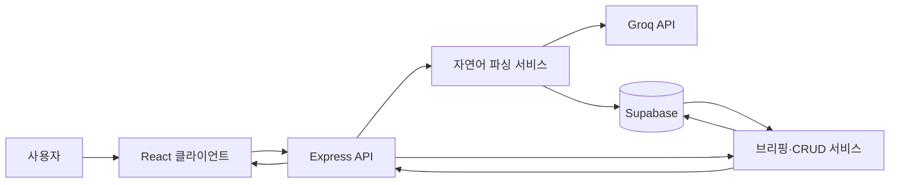

# Briefy

> 한 문장으로 기록하고, 한 화면에서 확인하는 개인 생활 관리 웹앱

Briefy는 한국어 자연어 입력을 일정·과제·루틴·식단·메모·리마인더로 구조화해
저장하고, 오늘 필요한 정보를 브리핑 화면에 모아 보여줍니다.

예를 들어 `금요일까지 데이터베이스 과제 제출`을 입력하면 AI가 제목과 마감일을
추출하고, 서버가 결과를 검증한 뒤 과제로 저장합니다. `다음주 화요일 오후 3시
팀플 회의, 전날 알려줘`처럼 한 문장에서 일정과 리마인더를 함께 만들 수도 있습니다.

## 현재 구현 범위

| 기능 | 상태 | 설명 |
| --- | --- | --- |
| 자연어 등록 | 완료 | 일정·과제·루틴·식단·메모·리마인더 생성 |
| 모호한 입력 되묻기 | 완료 | 후보를 선택하면 AI 재호출 없이 저장 |
| 루틴 완료 입력 | 완료 | `오늘 운동 다 함` 같은 문장으로 당일 완료 기록 |
| 오늘의 브리핑 | 완료 | 일정, 루틴, 식단, 미완료 과제·메모 표시 |
| 과제·메모 완료함 | 완료 | 완료, 복구, 영구 삭제 지원 |
| 자연어 조회 | 진행 전 | 현재 입력 원문을 메모로 보존 |
| 자연어 수정·삭제 | 진행 전 | 현재 입력 원문을 메모로 보존 |
| 푸시 알림 발송 | Phase 2 | 리마인더 저장까지만 구현 |

세부 진행 상황은 [checklist.md](./checklist.md)를 기준으로 확인합니다.

## 전체 구조

브라우저는 Supabase에 직접 접근하지 않습니다. 모든 데이터는 Express API와 Zod
검증을 거치며, Groq와 Supabase의 비밀 키는 서버에서만 사용합니다.



자연어 입력은 다음 순서로 처리됩니다.

1. `ChatInput`이 `POST /api/parse`로 원문을 전송합니다.
2. `parseService`가 현재 날짜와 스키마 정보를 포함한 프롬프트를 Groq에 전달합니다.
3. AI 응답을 `LlmOutputSchema`와 엔티티별 생성 스키마로 검증합니다.
4. 명확한 결과는 Supabase에 저장하고, 모호한 결과는 선택 후보를 반환합니다.
5. 저장 후 프론트엔드는 브리핑을 다시 조회해 화면을 갱신합니다.
6. 미지원 요청이나 구조화 검증 실패는 원문을 메모로 보존합니다.

## 디렉터리 안내

```text
hub/
├── src/                       # React 프론트엔드
│   ├── pages/                 # 화면 조합과 상태 관리
│   ├── components/
│   │   ├── briefing/          # 일정·루틴·식단·과제·메모 카드
│   │   ├── chat/              # 입력, 확인, 되묻기, 오류, 완료함
│   │   └── common/            # 공통 UI
│   ├── api/                   # Express API 호출 래퍼
│   ├── lib/                   # 프론트엔드 순수 변환 로직
│   ├── types/                 # 화면 상태 전용 타입
│   ├── App.tsx
│   └── index.css              # Tailwind import와 디자인 토큰
├── server/                    # Express 백엔드
│   ├── index.ts               # 서버 진입점과 라우터 등록
│   ├── routes/                # HTTP 요청 검증과 응답
│   ├── services/              # 파싱, 브리핑, CRUD, 루틴 계산
│   ├── lib/                   # Groq·Supabase 클라이언트, 프롬프트
│   └── scripts/seed.ts        # 개발 데이터 입력 스크립트
├── shared/
│   └── schemas.ts             # FE/BE 공용 Zod 스키마와 타입
├── supabase/
│   ├── migrations/            # DB 스키마 변경 이력
│   └── seed.sql               # SQL Editor용 개발 데이터
├── docs/                      # 기획, 디자인, 데이터 모델, 화면 자료
├── AGENTS.md                  # 모든 코딩 에이전트가 따르는 공통 규칙
├── CLAUDE.md                  # Claude Code에서 AGENTS.md로 연결하는 안내
└── checklist.md               # 구현 현황과 다음 작업
```

처음 코드를 읽을 때는 아래 순서가 가장 빠릅니다.

1. [BriefingPage.tsx](./src/pages/BriefingPage.tsx): 화면 상태와 사용자 액션
2. [parseService.ts](./server/services/parseService.ts): 자연어 파싱과 저장
3. [briefingService.ts](./server/services/briefingService.ts): 오늘 데이터와 루틴 순환 계산
4. [schemas.ts](./shared/schemas.ts): 데이터 계약
5. [0001_init.sql](./supabase/migrations/0001_init.sql): 실제 DB 구조

## 주요 계층의 책임

### 프론트엔드

`BriefingPage`가 브리핑 데이터, 오버레이, 완료 애니메이션을 관리합니다. UI 컴포넌트는
표현에 집중하고 서버 요청은 `src/api/`의 함수로 분리합니다. 배포 환경에서는
`VITE_API_BASE_URL`, 로컬에서는 Vite의 `/api` 프록시를 사용합니다.

### 백엔드

라우트는 요청 형식과 HTTP 오류를 담당하고, 서비스는 비즈니스 로직과 Supabase 접근을
담당합니다. 브리핑 서비스는 일정·과제·루틴·완료 기록·식단·메모를 병렬 조회하고,
`daily`, `weekly:*`, 순환 그룹 규칙에 따라 오늘 표시할 루틴을 계산합니다.

### 공유 스키마

`shared/schemas.ts`가 엔티티와 API 결과 타입의 단일 기준입니다. 프론트엔드와 서버가
같은 스키마에서 TypeScript 타입을 추론하므로 같은 타입을 각 계층에 다시 만들지 않습니다.

### 데이터베이스

테이블은 7개로 고정되어 있습니다.

| 테이블 | 역할 |
| --- | --- |
| `schedules` | 날짜와 시간이 정해진 일정 |
| `tasks` | 마감일과 완료 상태가 있는 과제 |
| `routines` | 반복 루틴의 정의와 내용 |
| `routine_logs` | 날짜별 루틴 완료 기록 |
| `meals` | 날짜별 아침·점심·저녁 식단 |
| `memos` | 자유 메모와 파싱 실패 원문 |
| `reminders` | 일정·과제에 연결된 알림 시각 |

모든 테이블은 사용자의 원문인 `raw_input`을 보존합니다. 상세한 설계 근거는
[데이터 모델 문서](./docs/data-model.md)에 있습니다.

## API

| 메서드와 경로 | 역할 |
| --- | --- |
| `GET /api/health` | 서버 상태 확인 |
| `POST /api/parse` | 자연어 파싱 후 저장 또는 되묻기 반환 |
| `POST /api/parse/resolve` | 되묻기 후보 확정 후 저장 |
| `GET /api/briefing?date=YYYY-MM-DD` | 지정 날짜의 브리핑 조회 |
| `GET /api/items/:type` | 항목 목록 조회 |
| `POST /api/items/:type` | 항목 생성 |
| `PATCH /api/items/:type/:id` | 항목 수정 |
| `DELETE /api/items/:type/:id` | 항목 삭제 |
| `POST /api/items/routines/:id/complete` | 날짜별 루틴 완료 상태 저장 |

`tasks`와 `memos` 목록은 `?completed=true|false`로 필터링할 수 있습니다. 오류 응답은
`{ "error": { "code": "...", "message": "..." } }` 형식을 사용합니다.

## 로컬 실행

요구 사항은 Node.js 20 이상, Supabase 프로젝트, Groq API 키입니다.

```bash
npm install
cp .env.example .env
```

`.env`에 다음 값을 입력합니다.

```dotenv
PORT=3001
GROQ_API_KEY=
SUPABASE_URL=
SUPABASE_SERVICE_ROLE_KEY=
```

Supabase SQL Editor에서 `supabase/migrations/`의 파일을 번호순으로 실행한 다음 개발
데이터를 넣고 서버를 시작합니다.

```bash
npm run seed
npm run dev
```

- 프론트엔드: `http://localhost:5173`
- 백엔드: `http://localhost:3001`

## 개발 명령어

| 명령어 | 설명 |
| --- | --- |
| `npm run dev` | 프론트엔드와 백엔드 동시 실행 |
| `npm run dev:client` | Vite만 실행 |
| `npm run dev:server` | Express를 watch 모드로 실행 |
| `npm run seed` | 오늘 기준 개발 데이터 입력 |
| `npm run test` | Vitest 단일 실행 |
| `npm run typecheck` | 프론트엔드·백엔드 타입 검사 |
| `npm run lint` | oxlint 검사 |
| `npm run format:check` | Prettier 형식 검사 |
| `npm run build` | 프론트엔드 프로덕션 빌드 |

## AGENTS.md와 CLAUDE.md

두 파일은 원래 Codex 계열 도구와 Claude Code가 각각 자동으로 찾는 프로젝트 지침 파일이라
함께 생겼습니다. 같은 규칙을 두 파일에 복사하면서 내용이 서로 달라지는 문제가 있었기
때문에 지금은 [AGENTS.md](./AGENTS.md)를 공통 규칙의 단일 기준으로 사용합니다.

[CLAUDE.md](./CLAUDE.md)는 Claude Code의 자동 탐색 호환성을 위해 남겨 둔 연결 문서입니다.
공통 규칙을 수정할 때는 `AGENTS.md`만 변경합니다. 공통 스킬의 기준은 `.agents/skills/`,
Claude Code 전용 에이전트와 명령은 `.claude/`에 둡니다.

## 배포

기준 구성은 프론트엔드 Vercel, 백엔드 Render입니다.

- Render: `npm install` 후 `npm start`, 서버 환경변수와 `CORS_ORIGIN` 설정
- Vercel: Vite 프리셋으로 `npm run build`, `VITE_API_BASE_URL`을 Render 주소로 설정
- Supabase: 마이그레이션 파일을 SQL Editor에서 번호순으로 직접 적용

## 관련 문서

- [서비스 기획](./docs/plan.md)
- [디자인 방향](./docs/design.md)
- [데이터 모델](./docs/data-model.md)
- [작업 체크리스트](./checklist.md)
- [에이전트 작업 규칙](./AGENTS.md)
